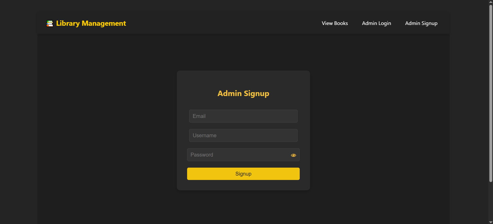
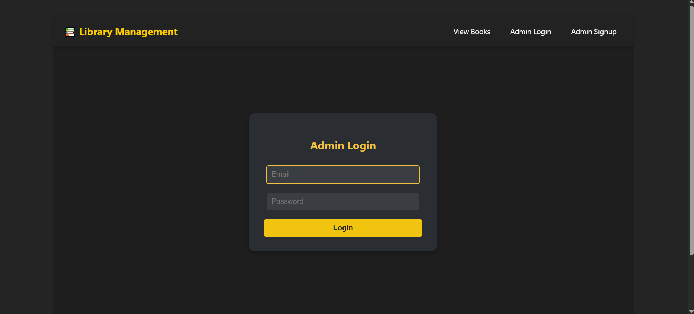
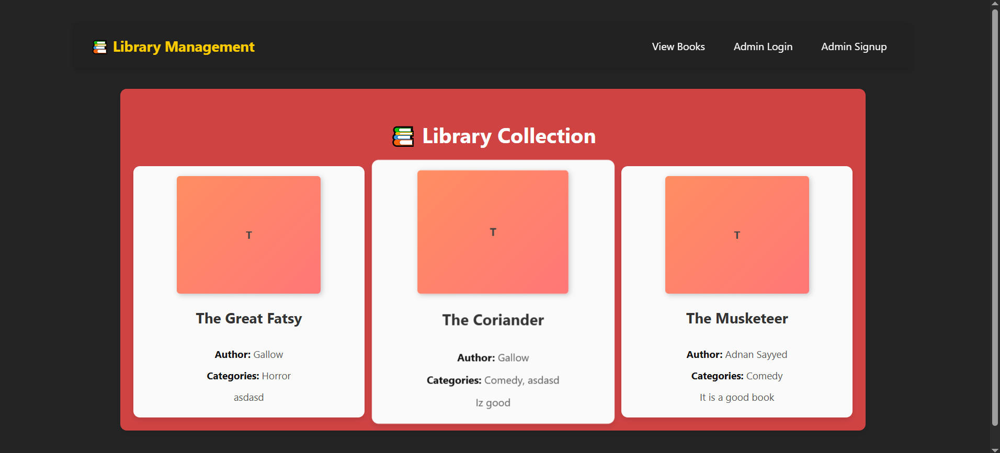
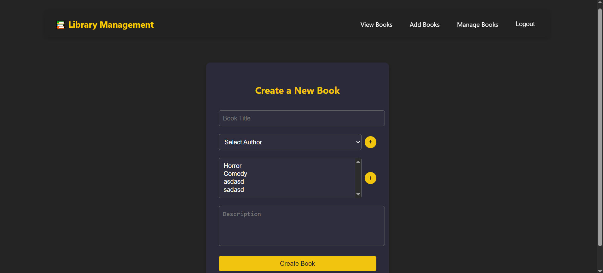
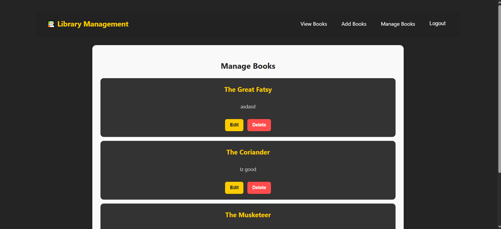
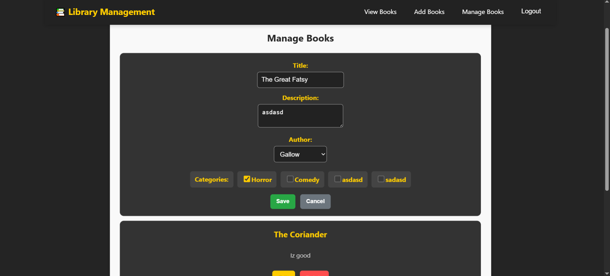

# **Library Management System**  

A simple **Library Management System** built using **Django (Django REST Framework) and React**.  
- **Backend:** Django + MySQL  
- **Frontend:** React (Vite)  
- **Authentication:** Token-based authentication  
- **Features:**  
  - **Admin Signup & Login**  
  - **Admin CRUD operations for books**  
  - **Students can view all books**  

---

## **📂 Project Structure**
```
KeywordioLibraryManagement/
│── backend/            # Django Backend (API)
│── frontend/           # React Frontend
│── README.md           # Project Documentation
│── .gitignore          # Git Ignore File
```

---

## **🚀 Installation & Setup**

### **1️⃣ Clone the Repository**
```sh
git clone https://github.com/DrangleicKnight/KeywordioLibraryManagement.git
cd KeywordioLibraryManagement
```

### **2️⃣ Backend Setup (Django)**
```sh
cd backend
python -m venv venv         # Create Virtual Environment
source venv/bin/activate    # Activate (For Mac/Linux)
venv\Scripts\activate       # Activate (For Windows)

pip install -r requirements.txt  # Install Dependencies
```

#### **🔧 Configure MySQL Database**
1. Run migrations:
   ```sh
   python manage.py makemigrations
   python manage.py migrate
   ```

#### **🔑 Create Superuser (Admin)**
```sh
python manage.py createsuperuser
```

#### **▶ Run Django Server**
```sh
python manage.py runserver
```

---

### **3️⃣ Frontend Setup (React)**
```sh
cd ../frontend
npm install   # Install Dependencies
npm run dev   # Start React Dev Server
```

---

## **📌 API Endpoints**

### **🔐 Authentication**
| Method | Endpoint            | Description        | Auth Required |
|--------|----------------------|--------------------|--------------|
| POST   | `/api/admin/signup/` | Admin Signup      | ❌ No        |
| POST   | `/api/admin/login/`  | Admin Login       | ❌ No        |

### **📚 Books Management**
| Method | Endpoint                 | Description          | Auth Required |
|--------|---------------------------|----------------------|--------------|
| POST   | `/api/books/create/`      | Create a Book       | ✅ Yes       |
| GET    | `/api/books/`             | Get All Books       | ❌ No        |
| PUT    | `/api/books/{id}/`        | Update Book         | ✅ Yes       |
| DELETE | `/api/books/{id}/`        | Delete Book         | ✅ Yes       |

### **👤 Authors & Categories**
| Method | Endpoint                   | Description            | Auth Required |
|--------|-----------------------------|------------------------|--------------|
| POST   | `/api/authors/create/`      | Create Author          | ✅ Yes       |
| GET    | `/api/authors/`             | Get All Authors        | ❌ No        |
| POST   | `/api/categories/create/`   | Create Category        | ✅ Yes       |
| GET    | `/api/categories/`          | Get All Categories     | ❌ No        |

---

## **🖼️ Screenshots**






---

## **🔧 Technologies Used**
- **Backend:** Django, Django REST Framework, SQLite  
- **Frontend:** React (Vite), Axios, React Router  
- **Authentication:** Token-based Authentication  
- **Styling:** CSS  

---

## **📜 License**
This project is for educational purposes only.  
